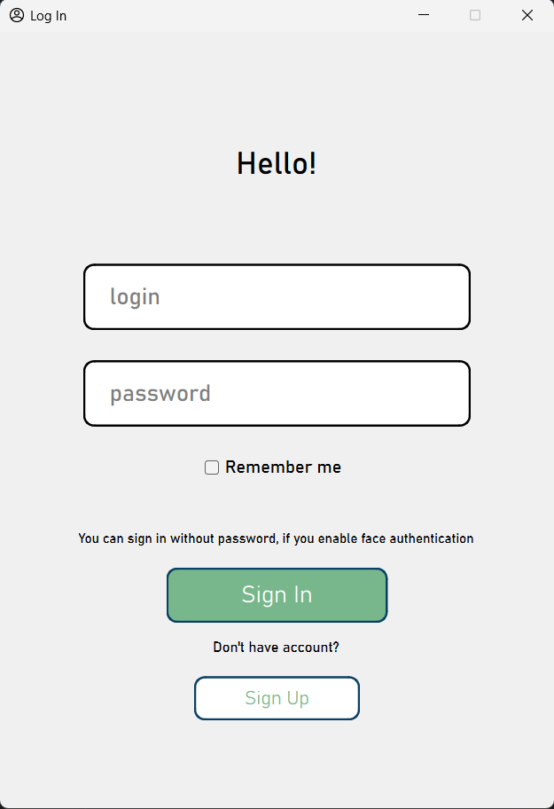

# Desktop App with Face Authentication

This repository presents my univercity coursework on theme: _**Creating a Person Identification Application**_.

# Contents

1. [Problem statement](#problem-statement)
    - [Goal](#goal)
    - [Tasks](#tasks)
2. [Software Toolset](#software-toolset)
3. [Description of software system](#description-of-software-system)

# Problem statement
## Goal

The main purpose of this work is to create an application for user identification using **neural networks** when trying to log in to a personal account.

## Tasks

To achieve the goal, the following tasks were performed:
1. Review of existing technologies
2. Designing the structure and interface of the application
3. Selection of relevant decision tools
4. Software implementation of the designed application
5. Increasing the ease of use of the application through the introduction of neural networks
6. Testing the received application to ensure correct operation

# Software Toolset

* Python 3
* Git
* PyQt6
* Qt Designer
* [Facenet-pytorch](https://github.com/timesler/facenet-pytorch)
* PostgreSQL 14
* Sphinx documentation

# Description of software system

This project includes the implementation of the application by creating several independent windows created using the PyQt6 framework and Qt Designer. 
This application structure was chosen to improve the readability and perception of the code. 
Each window has its own class and file, therefore, all methods implemented in the class will apply only to a specific window. 
Also, the user interface and the implementation of the methods of each window were divided into different classes and files to improve the readability of the code.

List of application windows:
* **[Account login window](#account-login-window)** – a window for entering a username and password (or face identification).
* **[Account registration window](#account-registration-window)** – a window for creating a new account in the system.
* **[Main application window](#main-application-window)** – application window for system navigation (profile view, application settings, etc.)

## Account login window

## Account registration window

## Main application window
