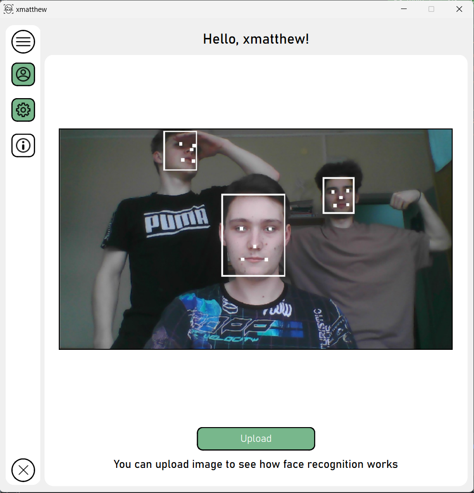
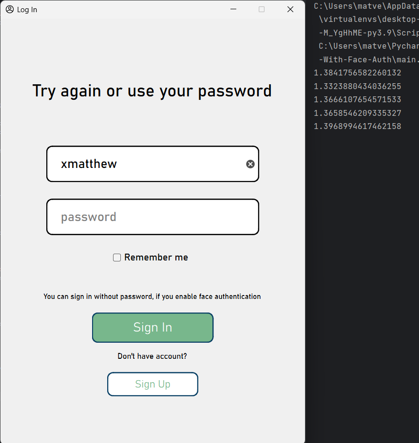

# Desktop App with Face Authentication

This repository presents my univercity coursework on theme: _**Creating a Person Identification Application**_.

# Contents

1. [Problem statement](#problem-statement)
    - [Goal](#goal)
    - [Tasks](#tasks)
2. [Software Toolset](#software-toolset)
3. [Description of software system](#description-of-software-system)
   - [Account login window](#account-login-window)
   - [Account registration window](#account-registration-window)
   - [Main application window](#main-application-window)
     - [Main menu](#main-menu)
     - [Profile menu](#profile-menu)
     - [Settings menu](#settings-menu)
4. [Testing](#testing)
5. [Conclusion](#conclusion)
6. [References](#references)

# Problem statement
## Goal

The main purpose of this work is to create an application for user identification using **neural networks** when trying to log in to a personal account.

## Tasks

To achieve the goal, the following tasks were performed:
1. Review of existing technologies
2. Designing the structure and interface of the application
3. Selection of relevant decision tools
4. Software implementation of the designed application
5. Increasing the ease of use of the application through the introduction of neural networks
6. Testing the received application to ensure correct operation

# Software Toolset

* Python 3
* Git
* PyQt6
* Qt Designer
* [Facenet-pytorch](https://github.com/timesler/facenet-pytorch)
* PostgreSQL 14
* Sphinx documentation

# Description of software system

This project includes the implementation of the application by creating several independent windows created using the PyQt6 framework and Qt Designer. 
This application structure was chosen to improve the readability and perception of the code. 
Each window has its own class and file, therefore, all methods implemented in the class will apply only to a specific window. 
Also, the user interface and the implementation of the methods of each window were divided into different classes and files to improve the readability of the code.

List of application windows:
* **[Account login window](#account-login-window)** – a window for entering a username and password (or face identification).
* **[Account registration window](#account-registration-window)** – a window for creating a new account in the system.
* **[Main application window](#main-application-window)** – application window for system navigation (profile view, application settings, etc.)

## Account login window

Available interface elements:
* Text field – initial value = “Hello!”, then it will be used to inform the user about errors
* _login_ field – user login input
* _password_ field – enter a user password
* _Remember me_ checkbox – when clicked, the application remembers the user and will not ask for re-authorization after closing
* _Sign In_ button – performs the user authorization procedure in the system using a password or face identification (if this option was enabled during registration or in the settings)
* _Sign Up_ button – opens the registration window in the system

## Account registration window

Available interface elements:
* **Required** fields for registration:
    * _name_ field – enter the name of user
    * _login_ field – entering the user's login in the system
    * _password_ field – entering the user's password in the system
* **Optional** fields for registration:
    * _surname_ field – entering the user's last name
    * _email_ field – enter the user's email address
* _Upload_ button – a button for uploading a photo to create a face layout and subsequent authentication using it. Immediately after selecting a photo, it is scanned for the presence of any face. If the face was not found, an error is displayed in the text field.
* _Sign Up_ button – performs the user registration procedure in the system and returns the user to the authorization window
* _Back_ button – returns the user to the authorization window without registering a new account

## Main application window
### Main menu

This window consists of two parts:
1. Slide menu for navigation. There are 3 states available:
   * completely closed
   * only page icons are shown (shown in the large screenshot, it is by default)
   * expanded, both icons and names of available pages are visible

2. Main page of the application, where you can see how face recognition works by uploading a photo. 
After the algorithm completes, a photo with a highlighted face or faces will appear on the main screen.

Available interface elements:

Slide menu:
* _Profile_ button – opens the user profile menu in the system
* _Settings_ button – opens the application settings menu
* _About_ button – opens the interface with a link to the project's GitHub repository
* _Close_ button – closes the exit menu

The main page of the application:
* _Upload_ button – upload a photo to demonstrate the operation of the facial recognition algorithm using a neural network.
* Text field – output of the processed image with the recognized face (empty by default)

### Profile menu

Available interface elements:
* Fields _name_, _surname_, _email_, _login_ – fields for displaying information entered by the user during registration.
* _Change password_ button – shows the user the fields for entering a new password.
* _Save_ button – saves data to the database if something has been changed
* _User avatar_ image – displays the uploaded image, when clicked opens a window for selecting a new image
* _Exit_ button – exits the user's account in the system and closes the application
* _Back_ button – returns the user to the main screen of the application

### Settings menu

Available interface elements:
* _Enable face authentication_ checkbox - When this function is enabled, 
the Upload button opens to upload a photo with the user's face. 
If everything went without errors, a message is displayed about the successful connection of the function. 
Otherwise, an error message will be displayed and the user will not be able to press _Back_ button to return 
to main menu. In this case, the user must either upload another photo or turn off the setting
* _Back_ button – returns the user to the main screen of the application

# Testing

An account was taken into which the user had previously uploaded an image with his face.
Next, an attempt was made to log in by the same user who created the account and an attempt to log in by a completely different person.

Account owner login attempt:

Stranger login attempt:

> Note: The authorization process is carried out in 5 attempts. 
The algorithm scans images from the user's device camera 5 times. 
For successful authorization, at least 3 out of 5 attempts must be successful. 
The attempt is considered successful if the distance between the embedding vectors of the 
face from the database and the face scanned from the camera is less than 0.5.

# Conclusion

During the implementation of this project, it was possible to consider in detail the field of neural networks and machine learning, 
as well as try to apply these technologies in practice. Based on the results of consideration of 
various relevant decision tools in face recognition using neural networks, the FaceNet model was 
chosen due to its high accuracy rates. Moreover, during the work, it was possible to successfully 
implement the selected model into the user interface of the designed application, thereby greatly
simplifying the authentication procedure in the application system.

This README.md is an abbreviated version of the explanatory note for the course project. 
The full version will be uploaded **later**.

# References

1. F. Schroff, D. Kalenichenko, J. Philbin. FaceNet: A Unified Embedding for Face Recognition and Clustering.
[here](https://arxiv.org/abs/1503.03832)
2. Facenet-pytorch repo: [here](https://github.com/timesler/facenet-pytorch)