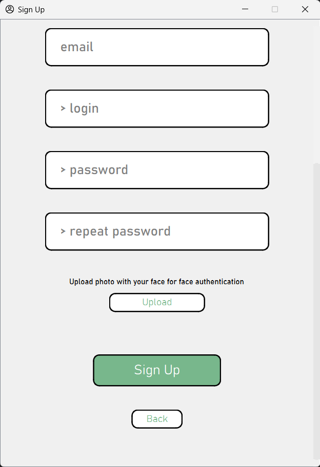
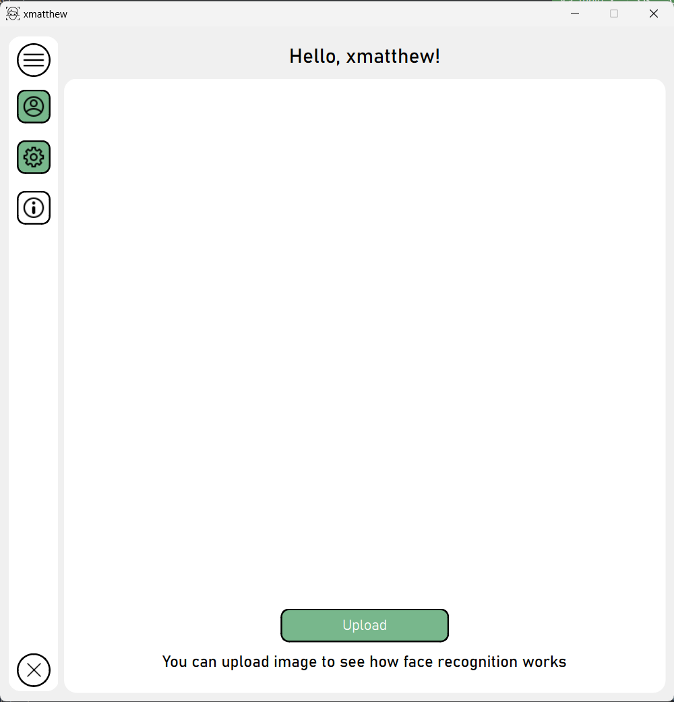

# Настольное приложение с аутентификацией по лицу

Доступные языки: [Английский](README.md), [**Русский**✅](README_ru.md)

В этом репозитории представлена моя университетская курсовая работа по теме:

***Создание приложения для идентификации персоны***

# Содержание

1. [Постановка проблемы](#постановка-проблемы)
    - [Цель](#цель)
    - [Задачи](#задачи)
2. [Использованные инструменты](#использованные-инструменты)
3. [Описание программной системы](#описание-программной-системы)
   - [Окно входа в аккаунт](#окно-входа-в-аккаунт)
   - [Окно регистрации аккаунта](#окно-регистрации-аккаунта)
   - [Главное окно приложения](#главное-окно-приложения)
     - [Главное меню](#главное-меню)
     - [Меню профиля](#меню-профиля)
     - [Меню настроек](#меню-настроек)
4. [Тестирование](#тестирование)
5. [Заключение](#заключение)
6. [Ссылки](#ссылки)

# Постановка проблемы
## Цель

Основной целью данного проекта является создание приложения для идентификации пользователя с использованием **нейронных сетей** при попытке входа в личный аккаунт.

## Задачи

Для достижения поставленной цели были выполнены следующие задачи:
1. Обзор существующих технологий
2. Разработка структуры и интерфейса приложения
3. Выбор актуальных инструментов решений
4. Программная реализация разработанного приложения
5. Повышение простоты использования приложения за счет внедрения нейронных сетей
6. Тестирование полученного приложения для обеспечения корректной работы

# Использованные инструменты

* Python 3
* Git
* PyQt6
* Qt Designer
* [Facenet-pytorch](https://github.com/timesler/facenet-pytorch)
* PostgreSQL 14
* Генератор документации Sphinx

# Описание программной системы

Этот проект включает в себя реализацию приложения путем создания нескольких независимых окон, созданных с использованием фреймворка PyQt6 и Qt Designer.
Такая структура приложения была выбрана для улучшения читаемости и восприятия кода.
Каждое окно имеет свой собственный класс и файл, следовательно, все методы, реализованные в классе, будут применяться только к определенному окну.
Кроме того, пользовательский интерфейс и реализация методов каждого окна были разделены на разные классы и файлы, чтобы улучшить читаемость кода.

Список окон приложения:
* **[Окно входа в аккаунт](#окно-входа-в-аккаунт)** – окно для ввода логина и пароля (или идентификации лица)
* **[Окно регистрации аккаунта](#окно-регистрации-аккаунта)** – окно для создания нового аккаунта в системе
* **[Главное окно приложения](#главное-окно-приложения)** – окно приложения для навигации по системе (просмотр профиля, настройки и т.д.)

## Окно входа в аккаунт

Доступные элементы интерфейса:
* Текстовое поле – начальное значение = “Hello!”, затем оно будет использоваться для информирования пользователя об ошибках
* поле _login_ – ввод логина пользователя
* поле _password_ – ввод пароля пользователя
* Флажок _Remember me_ – при нажатии на него приложение запоминает пользователя и не будет запрашивать повторную авторизацию после закрытия
* Кнопка _Sign In_ – выполняет процедуру авторизации пользователя в системе с использованием пароля или идентификации по лицу (если эта опция была включена при регистрации или в настройках)
* Кнопка _Sign Up_ – открывает [окно регистрации аккаунта](#окно-регистрации-аккаунта)

## Окно регистрации аккаунта

Доступные элементы интерфейса:
* **Обязательные** поля для регистрации:
    * поле _name_ – ввод имени пользователя
    * поле _login_ – ввод логина пользователя
    * поле _password_ – ввод пароля пользователя
* **Необязательные** поля для регистрации:
    * поле _surname_ – ввод фамилии пользователя
    * поле _email_ – ввод электронной почты пользователя
* Кнопка _Upload_ – кнопка для загрузки фотографии для создания макета лица и последующей аутентификации с его помощью. Сразу после выбора фотографии она сканируется на наличие какого-либо лица. Если лицо не было найдено, в текстовом поле отображается сообщение об ошибке.
* Кнопка _Sign Up_ – выполняет процедуру регистрации пользователя в системе и возвращает пользователя в [окно авторизации](#окно-входа-в-аккаунт)
* _Back_ – возвращает пользователя в [окно авторизации](#окно-входа-в-аккаунт) без регистрации новой учетной записи

## Главное окно приложения
### Главное меню

Это окно состоит из двух частей:
1. Слайд-меню для навигации. Доступно 3 состояния:
   * полностью закрыто
   * отображаются только значки страниц (показаны на скриншоте, стоит по умолчанию)
   * развернуто, видны как значки, так и названия доступных страниц

2. Главная страница приложения, где вы можете увидеть, как работает распознавание лиц, загрузив фотографию.
После завершения работы алгоритма на главном экране появится фотография с выделенным лицом или лицами.

Доступные элементы интерфейса:

Слайд-меню:
* Кнопка _Profile_ – открывает [меню профиля](#меню-профиля) пользователя в системе
* Кнопка _Settings_ – открывает [меню настроек](#меню-настроек) приложения
* Кнопка _About_ – открывает меню со ссылкой на репозиторий проекта на GitHub
* Кнопка _Close_ – закрывает меню

Главная страница приложения:
* Кнопка _Upload_ – загрузить фотографию, чтобы продемонстрировать работу алгоритма распознавания лиц с использованием нейронной сети
* Текстовое поле – вывод обработанного изображения с распознанным лицом (по умолчанию пустое)

### Меню профиля

Доступные элементы интерфейса:
* Поля _name_, _surname_, _email_, _login_ – поля для отображения информации, введенной пользователем при регистрации
* Кнопка _Change password_ – показывает пользователю поля для ввода нового пароля
* Кнопка _Save_ – сохраняет данные в базе данных, если что-то было изменено
* Изображение аватара пользователя – отображает загруженное изображение, при нажатии на которое открывается окно для выбора нового изображения
* Кнопка _Exit_ – выход из учетной записи пользователя в системе и закрытие приложения
* Кнопка _Back_ – возвращает пользователя на [главный экран приложения](#главное-меню)

### Меню настроек

Доступные элементы интерфейса:
* Флажок "_Enable face authentication_" - когда эта функция включена,
открывается кнопка "_Upload_" для загрузки фотографии с лицом пользователя.
Если все прошло без ошибок, выводится сообщение об успешном подключении функции.
В противном случае будет выведено сообщение об ошибке, и пользователь не сможет нажать кнопку _Back_, чтобы вернуться
в главное меню. В этом случае пользователь должен либо загрузить другую фотографию, либо отключить настройку
* Кнопка _Back_ – возвращает пользователя на [главный экран приложения](#главное-меню)

# Тестирование

Была создана учетная запись, в которую пользователь ранее загрузил изображение со своим лицом.
Затем была предпринята попытка войти в систему тем же пользователем, который создал учетную запись, и попытка войти в систему посторонним человеком.

Попытка входа владельца учетной записи в систему:

Попытка входа постороннего человека в систему:

> Примечание: процесс авторизации осуществляется в 5 попыток. 
Алгоритм сканирует изображения с камеры устройства пользователя 5 раз.
Для успешной авторизации необходимо, чтобы хотя бы 3 из 5 попыток были удачными. 
Попытка считает удачной если расстояние между векторами эмбеддингов лица из базы данных и лица, 
сканированного с камеры, меньше 0.5

# Заключение

В ходе реализации этого проекта удалось подробно рассмотреть сферу нейронных сетей и машинного обучения,
а также попробовать применить эти технологии на практике. Основываясь на результатах рассмотрения
различных актуальных инструментов решений в распознавании лиц с использованием нейронных сетей, была выбрана модель FaceNet 
из-за ее высоких показателей точности. Более того, в ходе работы удалось успешно
внедрить выбранную модель в пользовательский интерфейс разработанного приложения, тем самым значительно
упростив процедуру аутентификации в приложении.

Этот README файл представляет собой сокращенную версию пояснительной записки к курсовому проекту.
Полная версия будет загружена **позже**.

# Ссылки
1. F. Schroff, D. Kalenichenko, J. Philbin. FaceNet: A Unified Embedding for Face Recognition and Clustering :
[here](https://arxiv.org/abs/1503.03832)
2. Репозиторий Facenet-pytorch : [here](https://github.com/timesler/facenet-pytorch)